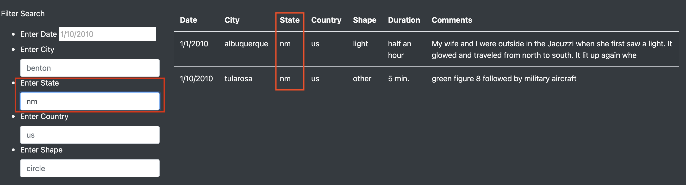

# UFOs

## __Purpose:__

The aim of this project is to build a dynamic webpage that filters and displays required data in a table format, based on user input.This is accomplished by using Javascript on an HTML page and using Bootstrap and CSS to format and style the page. 

In this case, the webpage will display UFO sighting related information in an interactive and neatly presented webpage based on available raw data of various UFO sightings. Filters will be available for users to enter search criteria such as location, date and other details, so that the data is displayed based on criteria entered.

## __Results__:

The webpage created can be seen in the screenshots below:

The webpage has an attractive header with a write up about the data analysis of UFO sightings. Beneath that is a table which by default displays all the data on UFO sightings based on our raw data available. A user can scroll down to see all the data, but that would be voluminous.

To address this, the Filter Search section is available beside the table with the following filter criteria:
- Date
- City
- State
- Country
- Shape

Each field contains an example of the format in which the criteria should be entered by the user.

The Filter Search can be seen in the screenshot below:

In order to filter the tabular data to make it more concise or to only view data of interest, the user can enter search criteria in the search fields. For example, if a user is looking for information on sightings in New Mexico, he/she can enter "nm" in the "Enter State" field and hit enter on their keyboard.

The data table will change automatically and only display sighting information for New Mexico as can be seen below:

If the user wants to search for a combination of filter criteria, he/she can enter in multiple fields too, and the table would display all the data relevant to the combination of search fields.For example, of the user wants to view sightings only in Albuquerque, New Mexico, they can enter both the city and state in the filter search and hit enter on the keyboard. The table will display only data that meet both of these criteria, as seen below:

## __Summary__:
A couple of drawbacks of this webpage design would be:
1. There is no paging for the results section. So, if there are multiple results in the table section, the user will have to scroll all the way down to look at all the results.
2. There is no "Clear search" button. The user will have to manually delete whatever is entered, to enter new criteria.

### __Recommendations:__

1. For searching by date, it may be better to search by a data range than a single date, because users may not remember a specific date, that they would like to search by.
2. It will also be helpful to have the city, state, country and shape as dropdown menus, because users will not know what to enter and may find it easier to choose from a list that is available. The fields could also show suggestions, when a user manually enters the text, just to avoid spelling errors etc.